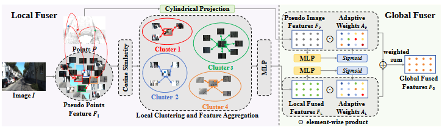
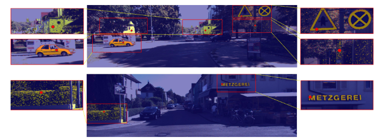

## DVLO
The official codes for ECCV 2024 Oral paper: 'DVLO: Deep Visual-LiDAR Odometry with Local-to-Global Feature Fusion and Bi-Directional Structure Alignment'

Jiuming Liu, Dong Zhuo, Zhiheng Feng, Siting Zhu, Chensheng Peng, Zhe Liu, and Hesheng Wang

## 📣 News
- **[5/Oct/2024]** We have released the codes for DVLO!
- **[12/Aug/2024]** Our work has been selected as **Oral** presentation in ECCV 2024!

## Pipeline


## Installation
Our model only depends on the following commonly used packages.

| Package      | Version                          |
| ------------ | -------------------------------- |
| CUDA         |  1.11.3                          |
| Python       |  3.8.10                          |
| PyTorch      |  1.12.0                          |
| h5py         | *not specified*                  |
| tqdm         | *not specified*                  |
| numpy        | *not specified*                  |
| openpyxl     | *not specified*                  |

Device: NVIDIA RTX 3090

## Install the pointnet2 library
Compile the furthest point sampling, grouping and gathering operation for PyTorch with following commands. 
```bash
cd pointnet2
python setup.py install
```

## Install the CUDA-based KNN searching and random searching
We leverage CUDA-based operator for parallel neighbor searching [Reference: [EfficientLONet] (https://github.com/IRMVLab/EfficientLO-Net)]. You can compile them with following commands. 
```bash
cd ops_pytorch
cd fused_conv_random_k
python setup.py install
cd ../
cd fused_conv_select_k
python setup.py install
cd ../
```

## Datasets
## KITTI Odometry
Datasets are available at KITTI Odometry benchmark website: [ https://drive.google.com/drive/folders/1Su0hCuGFo1AGrNb_VMNnlF7qeQwKjfhZ](https://www.cvlibs.net/datasets/kitti/eval_odometry.php)
The data of the KITTI odometry dataset should be organized as follows: 

```
data_root
├── 00
│   ├── velodyne
│   ├── calib.txt
├── 01
├── ...
```

## Training
Train the network by running :
```bash
python train.py 
```
Please reminder to specify the `GPU`, `data_root`,`log_dir`, `train_list`(sequences for training), `val_list`(sequences for validation).
You may specify the value of arguments. Please find the available arguments in the configs.py. 

## Testing
Our network is evaluated every 2 epoph during training. If you only want the evaluation results, you can set the parameter 'eval_before' as 'True' in file config.py, then evaluate the network by running :
```bash
python train.py
```
Please reminder to specify the `GPU`, `data_root`,`log_dir`, `test_list`(sequences for testing) in the scripts.
You can also get the pretrined wieghts in the pretrain_weights file.

## Clustering Visualization


## Citation
```
@article{liu2024dvlo,
  title={DVLO: Deep Visual-LiDAR Odometry with Local-to-Global Feature Fusion and Bi-Directional Structure Alignment},
  author={Liu, Jiuming and Zhuo, Dong and Feng, Zhiheng and Zhu, Siting and Peng, Chensheng and Liu, Zhe and Wang, Hesheng},
  journal={arXiv preprint arXiv:2403.18274},
  year={2024}
}
```
## Acknowledgments
We thank the following open-source project for the help of the implementations:
- [PointNet++](https://github.com/charlesq34/pointnet2) 
- [PWCLONet] (https://github.com/IRMVLab/PWCLONet)
- [RegFormer] (https://github.com/IRMVLab/RegFormer)
